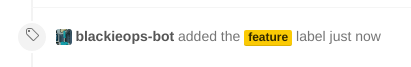

# Secretary

I like branch categories. What I realised I would also like is if my pull
requests in Github were filterable based on that category. This is a small
webhook--ahem--"microservice" to consume github webhooks and then label newly
opened PRs with a label that matches their branch category.



## Development

This is an [Elixir][1] application.

```
$ mix deps.get
$ cp config/config.dev.exs.example config/config.dev.exs
$ iex -S mix
```

The app will now be listening on `localhost:4000`.

## Deployment

This is an Erlang/Elixir application, so deployment should be fairly
straightforward.

* Ensure you are compiling on the same OS as the production server.
* Ensure you have configured `config/config.prod.exs` with the right values.
* Run `MIX_ENV=prod mix release`
* Upload `rel/secretary/releases/$VERSION/secretary.tar.gz` to a server (where
  `$VERSION` is the release that is in `mix.exs`).
* On the server, extract the tarball and run `bin/secretary start` to start a
  forked background process.

### Extra: A systemd service

If manually starting the daemon feels wrong to you, you are correct! This is no
way to treat a production system. Rather, here's a nice succinct systemd unit
for you to place at `/etc/systemd/system/secretary.service`:

```ini
[Unit]
After=networking.target

[Service]
ExecStart=/usr/local/secretary/bin/secretary foreground
ExecStop=/usr/local/secretary/bin/secretary stop
User=secretary
RestartSec=5

[Install]
WantedBy=multi-user.target
```

Of course, changing `/usr/local/secretary` to reflect the path where you
extracted the tarball.

## Github Setup

Once the app is running, invite your bot user to the repository with write
permissions so it has permissions to label things.

Then, under "Settings" -> "Webhooks" on your repository, add a new webhook.

* Configure the URL to be wherever you hosted Secretary
* For the events, select "Let me select individual events" and check **only**
  `Pull Request`.

Save the webhook, and new PRs should be labelled (existing ones should get
labelled once interacted with).

## License

See [LICENSE](./LICENSE).
